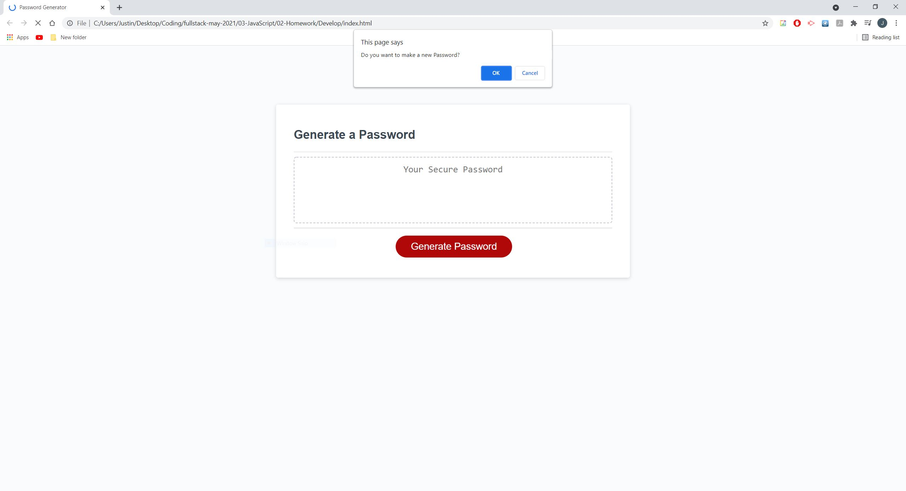

# Password-Creator/Generator - HW
Javascript Password Generator

## Overview/Description
The project/activity is to test the knowledge and the capabilities of the developer when it comes to javascript. They will use their knowledhe of javascript to create logic logic that they web application can use to perform certain functions the developer will needs or wants. In addition, the project will also teach developers how to create functions with working logic. Developers will alos learn how to use different windows like prompts and alerts to communicate with the users. They will also learn to use inputs thus able to get input from users and have these input affect the web application. Overall, the project will test the knowledge of the web developers of not only javascript but also how to formulate logic that can than be transcribed by the web application as well as gaining information from the user as well.

## Goal
The goal of this project is to create a generator that creates a password. This generator can create a password consist of characters, uppercase characters, numbers, and characters that are classified as special characters. the length of the password is based on length that the user inputs. In addition, the generator can determine if the user wants to leave out certain characters besides normal letters. When prompted, they can either have or don't have special characters, numbers or upper case letters. 

## Key Topics

## Learning Objectives

## Screeshots/Image
--Basic rough draft of the password generator code--

--The generator in action where the results are shown in the console log--

--Adding boolean values used to check if a certain password criteria is selected--  
--Input prompt for user length password and criteria prompts--

--User prompts in action--

--Generating a New Password--

--Utilizing the HTML instead of Prompts--

--Final Application (Beginning)--

--Final Application (Ending)--

## Working Application
